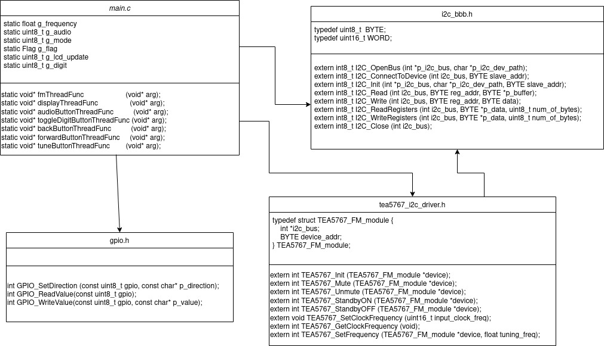
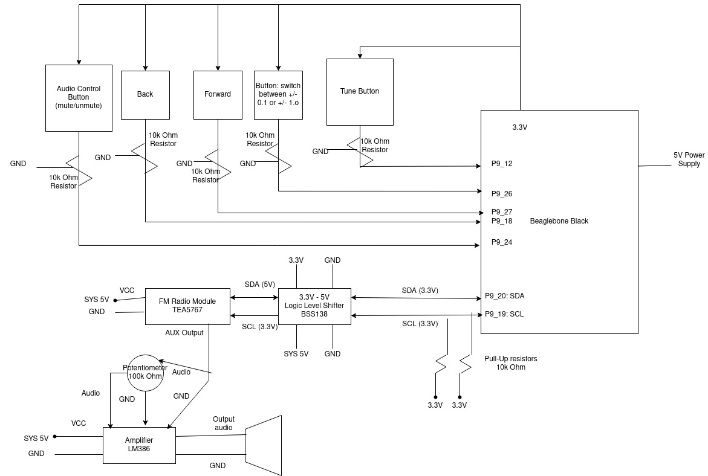
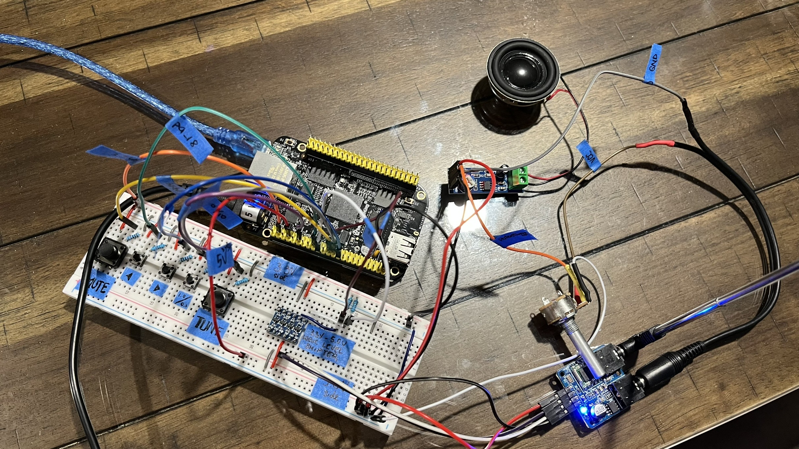

# TEA5767 FM Stereo Radio
## Introduction
The device scans the radio frequency range from 87.5 MHz to 108 MHz, demodulates a radio signal and outputs the audio to the speaker. The audio mode (mute/unmute), audio volume and tuned frequency can be controlled through buttons and a potentiometer. The control view is output to terminal console.

This is a master project for Software Engineer for Real-Time Embedded System course at GMU.

## Project requirements/constraints:

**Environment**
* SBC: BeagleBone Black
* Operating System: RTEMS, FreeRTOS, or Linux with Preept-RT patch (Must be a real-time operating system that implements priority-based preemptive scheduling)
* Language: C

**Application**
* Multi-tasking (minium of 3 threads/tasks)
* Must have some sort of timing requirements

## Project Structure
**Software architect design**


**Hardware architect design**


## Demonstration


Video for functionality demo: https://drive.google.com/file/d/15QDYuyPiEBIa3TpLnZ_qIVPnMZWrac7U/view?usp=sharing

## Installation
Clone this project
```
git clone git@github.com:vymphan/tea5767-fm-receiver.git
```
Make sure the build script inside the project directory is executable
```
chmod +x ./start.sh
```
Build
```
./start.sh
```

